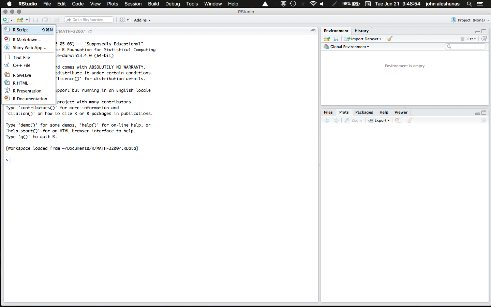

```{mermaid}
%%| fig-width: 9
%%| fig-height: 2.5
flowchart LR
    A["Step 1:<br>Scripts & Projects"] --> B["Step 2:<br>Working Directory"] --> C["Step 3:<br>Libraries"] --> D["Step 4:<br>Import & Export"]
    style A fill:#1a1a1a,stroke:#1a1a1a,color:#fff
    linkStyle default stroke:#adb5bd,stroke-width:2px
```

## Scripts

You can type your R code into two places: either in the console (i.e., the bottom left corner of RStudio) or into a script (i.e., the top left corner of RStudio). It is good practice to do everything in a script because you can troubleshoot your code much more easily and reproduce everything you do.

You can open a new script by clicking the dropdown menu **File >> New File >> R Script**. Alternatively, in RStudio you can click on the icon that looks like a plus on top of a black sheet of paper. It will provide a dropdown menu that will allow you to open a new R script.



[Go here for more information on R Scripts.](https://r4ds.hadley.nz/workflow-scripts#scripts)

## R Projects

A lot of set up in R is easy to organize using R projects. However, that is beyond the scope of this tutorial.

[Go here for information on R projects and setting one up.](https://r4ds.hadley.nz/workflow-scripts#projects)

## Starting with a clean slate

To see if your script is working or just to start fresh, the absolute best practice is to **restart RStudio** to clear its memory. But you need to make a change to the global options first so it does not automatically load your last session.

To do this, go to **Tools >> Global Options** and uncheck "Restore .RData into workspace at startup". This will clear the workspace every time.

A second option, which people use when a quick reset is needed, is the function `rm(list=ls())`. This clears all objects in R memory, but it does not detach libraries you have loaded, nor does it reset global options. It is always recommended to restart RStudio when you want to work with a truly clean slate. But many times a quick `rm(list=ls())` will suffice.
